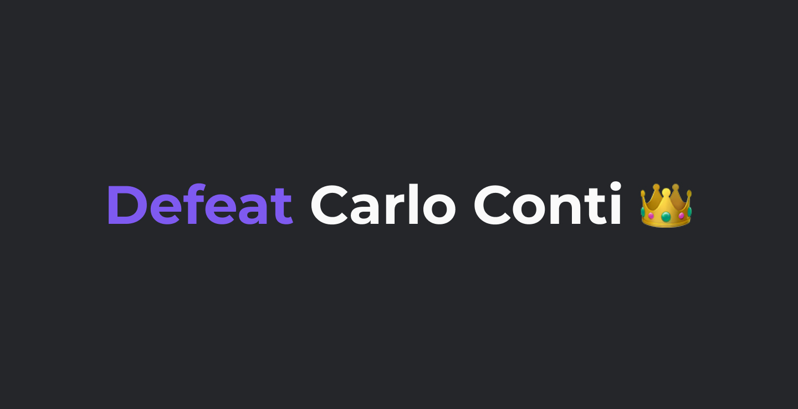

# 👑 Defeat Carlo Conti



## Panoramica del progetto

Defeat Carlo Conti è una web app quiz creata interamente con React.js. Consiste in un quiz di 10 domande, nel quale ogni domanda contiene 4 risposte, ma solo una è corretta! Hai a disposizione 20 secondi per rispondere ad ogni domanda, se il timer arriva a 0 oppure sbagli la risposta dovrai riniziare da capo.

## Avvio progetto

### Scaricare package e dependencies

Per installare i vari package e dependecies che permettono al progetto di funzionare digitare tale comanda nel terminale:

```
npm install
```

### Fake server

Questa quiz app utilizza il pacchetto npm [JSON Server](https://www.npmjs.com/package/json-server) che permette di creare un mock. Esso in questo caso simula l'arrivo di domande e risposte da un fake-server esterno in formato **.json**. Per visualizzare correttamente le domande digitare la seguente istruzione all'interno del terminal (non è obbligatorio l'utilizzo della porta 8000, ma è consigliato):

```
npx json-server --watch data/dbQuestions.json --port 8000
```

### Visualizzare il progetto

Una volta installato l'npm Json Server, per visualizzare e poter giocare all'interno del browser, inserire all'interno del terminal il seguente comando:

```
npm start
```

---

Buon divertimento! 🎉
